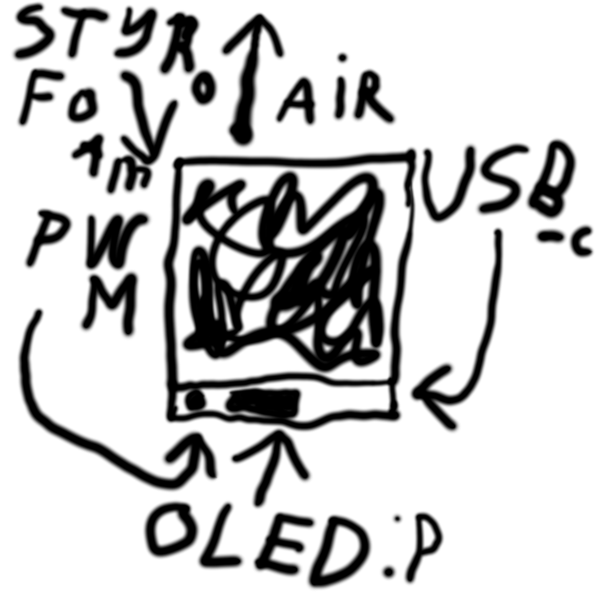

# May 25-th: Idea

Tell @TheEternalComrade that his idea is now OUR property. We aren't teaming, I just permanently borrowed it.  
Anyways, here's a little sketch I made on my ARM Chromebook with pmOS:   
I hereby release it (as well as this very journal) under WTFPL 2.0.

There would be an SSD1331 screen. It's a tiny RGB565 one: grayscale is roughly the same price so why not! Roughly 10 bucks locally.  
The framerate is gonna be pretty painful due to throughput but it's workable since it would only display stats.  
And a potentiometer to control the target RPMs. And uhhh, a piece of styrofoam. That's it. Acorn said that's complex enough. 
I sure do hope that a Noctua Redux is "economically efficient" enough. Haven't decided on the microcontroller.  
3D printing is DAMN expensive tho.

**Time wasted: ~4 hours (or 15m excluding being zoned out).**
