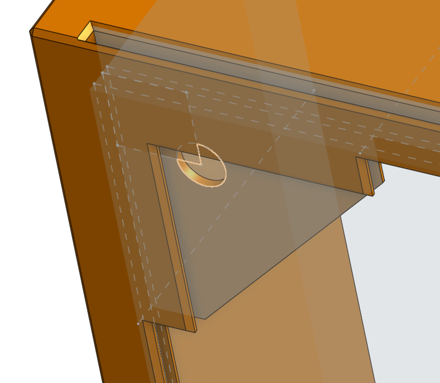
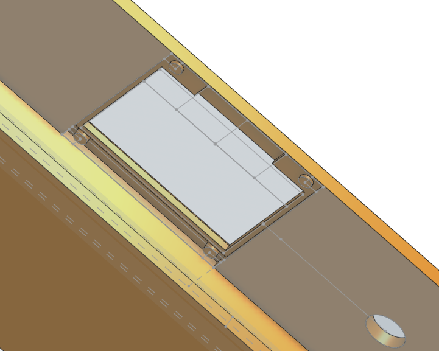
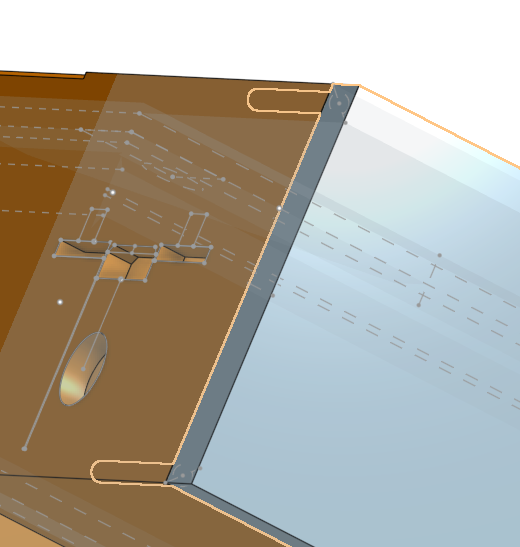
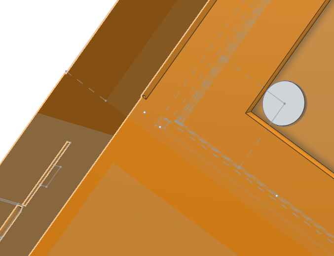
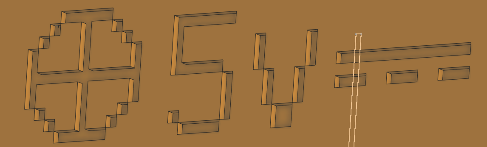

**Total time wasted: 35.4 hours**

# May 24-th: Idea

Tell @TheEternalComrade that his idea is now OUR property. We aren't teaming, I just permanently borrowed it.  
Anyways, here's a little sketch I made on my ARM Chromebook with pmOS:   
I hereby release it (as well as this very journal) under WTFPL 2.0, as published by Sam Hocevar, on top of the existing GPLv3 license.

Anyways, see the description.  
There would be an SSD1331 screen. It's a tiny RGB565 one: grayscale is roughly the same price so why not! Roughly 10 bucks locally.  
The framerate is gonna be pretty painful due to throughput but it's workable since it would only display stats.  
And a potentiometer to control the target RPMs. And uhhh, a piece of styrofoam. That's it. Acorn said that's complex enough. 
I sure do hope that a Noctua fan is "economically efficient" enough. Haven't decided on the microcontroller.  
3D printing is DAMN expensive tho.

**Time wasted: ~4 hours (or 15m excluding being zoned out).**

# May 25-28: 3D modeling and hardware picks
### (i am sorry if my humor doesn't work and I am stuck with the same patterns, that's what happens when you journal near bedtime but not quite)
First I tried getting FreeCAD running (because software freedom) but it just hangs when opening an example file.  
So I signed up for OnShape and began working. I downloaded some models from GrabCAD for reference purposes which I can't show due to the license agreement.  
The first thing I had to do is figure out what the fuck a sketch is. After that I extruded out a frame piece and a bottom control piece as solid blocks of plastic which I used the shell tool on.  
Immediately made the other wall of the top shell extruded infinitely inwards to make a frame for a 140mm fan.  
Oh, and I have decided to base it on a Noctua NF-A14 5V PWM, because that's the only powerful enough 5v fan I could find for a reasonable price, ironically.  
I am going 5v because converting 5v to 12v then to variable voltage in a brushless DC seems redundant. And I want this to run off of a powerbank.  
I learned how to create some <u> *grooves* </u> I can shove wires into with a sketch then chamfered it all away to be smooth like butter. I prefer this over fillet because minimalism.  
Now, no styrofoam, too simple. I found a listing for a bunch of activated carbon filtery magicy sheets. Perfect for this. But I *like* the fumes, actually, I still want the smell, oh welp :(  
No idea what width they are so I just made a slot as big as I can with thin-ish walls that I can *probably* sand down but also not thin enought that they will break.  
  
The scary part was the IO holes. I first ran simple booleans on existing models before quickly realizing what I have done. Lawyers are coming against me.  
So I used the existing models for reference then drew a sketch over it while looking at actual measurement schematics. 
And then I realized that I made everything on the wrong side and had to move everything over.  
#### May 30-th editor intervention: holy shit my grooves are now wrong. I will pretend that's intended as I don't wanna touch the model again and it looks ***aesthetic***.  
I bet I did the microcontroller all wrong, too, and will have to hotglue. Well, that was the original plan anyway.  
Same thing with the screen, tried to make it flush-ish with the case plus leave some space for solder joints. Oh, and a generic potentiometer.  
  
Speaking of the microcontroller, I went to a local electronics store site, went to dev boards (not the Arduino category, fuck that, I said so) then sorted by price:

1. STM8s? I am really paranoid that it won't be enough to render a little rainbow animation via SPI. Or, uhhh, a that one not-a-rhythm-game shitpost.  
	Also, the good Mini-USB ones are all out of stock, stuck with M*cro-USB :puke:.
2. STM32F401CCU6 with USB-C? This was my original plan. But it's locked at 500mAh. Not enough ***potuzhnist'***. And trying to solder a proper pulldown for more is painful and warranty voiding.
3. STM32F103ZET6 swagging dual Mini-USB? Too fat. Also, extremely overpriced.

Sooo, we are going with a blue pill compatible STM32F103C8T6 with M*cro-USB + external barrel plug. Lame, I know. I don't actually have the programmer but apparently there's UART flashing...  
I already have a cut off barrel plug with a piece of a USB-A port on it because of failed TV-box shenanigans. And I think I will put a schottky and a zener for some protection. Safety first!

As you could tell, there are no screw holes. That's right, friction and hot glue. And the bottom cover/base is just sticks sticking out.  
  
Screws are actually at my local bazaar for like 0.2 to 2 UAH depending on size, and 1 UAH is currently ~0.024 freedoms, but ain't no fun in that. I don't want screws sticking out. ***AESTHETIC***.  
Fillet, fillet, fillet. For those reading still unaware what that means, it's basically making diagonals in place of a straight 90 degree turn. And I put that everywhere I could.  
Now, I was already paranoid that the sticks of my base aren't strong enough and filleting the outside would reduce the amount of plastic there. Plus not enough weight at base.  
So I tried some plugin a random guy made called "split edge", to, well, split the edges and fillet only everything above the sticks. But the fillet tool thought otherwise,  
so I just sliced the whole model, did some filleting, then merged them back into one, and made even more filleting for the transition. Looks spikey, *very* ***aesthetic***.
  
Yes, this took me [roughly the span of time it takes for our planet, Terra, also known as Earth, to rotate around it's axis roughly three consecutive times](https://hackclub.slack.com/files/U08SC2YN94H/F08VDLPF4L8/the_day_of_a_common_calendar_year_which_was_recommended_by_the_producer_of_a_certain_good_on_which_the_aforementioned_good_ceases_to_be_of_quality_that_would_guarantee_safe_human_consumption_without_unwanted_consequences_to_the_body__an_intention...webm)  

**Time wasted: ~18 hours (inaccurate estimate, zoning out excluded this time)**

# May 30-th: Nothing
I took a break.

**Time wasted: ~0 hours**

# May 31-st: Journaling
I spent some time writing this journal, taking screenshots and *also* taking a break.  
Actually, due to the lack of feeling of fulfillment from the last day, I did various kinds of crimes against myself, including stuffing myself with sugars all the way up.  
I still have a README and a local BOM to go before submission to Highway.

**Time wasted: ~1 hour**

# June 2nd: Text Adventure
  
This info label took me an unreasonable amount of time.  
First, I got Unifont the epic 16px bitmap pixel font and looked for the perfect symbols to signal "center postive DC".  
Go into InkScape, make a small image, export as SVG, import into OnShape. You can't use SVGs in OnShape sketches, for some reason. Rasterize. You can't extrude or reference bitmaps in sketches, they are reference only.  
Vectorize it by finding some obscure pixel art converter (forgot link and it took me an hour, sorry, good luck) that makes an SVG with square <rect>s, then put it back into InkScape, then export as DXF.  
Import into OnShape, use in sketch. Attempt moving it. Apparently there are no constraints. Fuck me sideways.  
Manually select lines on each row and column to put in the parallel constraints then select everything and put in the equal constraints. Try moving. Then I realize that the points of each square aren't constrained either.  
Instead of trying to manually constrain all points I gave up, fiddled around to select the squares but not the other parts of the sketch, then just dragged the whole thing away, then I used the transform tool to resize it, dragged it back.  
And, it's apparently mathematically impossible to share an edge between cutouts, as that would require an inifitely small amount of material as well ass infinite precision, so the universe will collapse under the stress of bitmap text.  
To combat this, I tried using every single tool from the quickbar. Yes, all of them. None helped or resulted in something that I would want.  
The solution is to make the extrution 1 degree tilted. Yes, really. There's no other way. And now dust will get stuck in the hole but I am not gonna change it because of how much time it took me to get there.

**Time wasted: ~4 hours** (I've been needing to shit for the past 4 hours)

# June 1-18th: Dissapointment
I got banned :yay:. Rowan said he can pitch for me. And I forgot about this project. Everything even the slightliest bit productive, too. Clicked some extremely inefficiently rendered virtual circles for entertainment instead.

**Time wasted: ~0.4 hours**
# June 19-25th: Clean up and discovery
Making the BOM, README, journaling, all that kind of stuff. And the new illustration for wiring. I was too lazy to grab the tablet so I used my mouse this time. 
Also, I double-clicked a .stl file, which opened FreeCAD. And it actually worked. Which hanged on me before.  
Which means that instead of hot turky style learning a server based tool that might not even exist one day then exporting into another file format with a lot of data loss,  
I could have just used the FOSS alternative the whole time. Gawd matherfacking dayum.  

**Time wasted: ~8 hours**

# June 26-28th: Rowan, what the fuck
Bruv pretened to be offline while talking about puppy OC comissions in slack

gigicat pitched for me, all hail gigicat

**Time wasted: ~0 hours**
